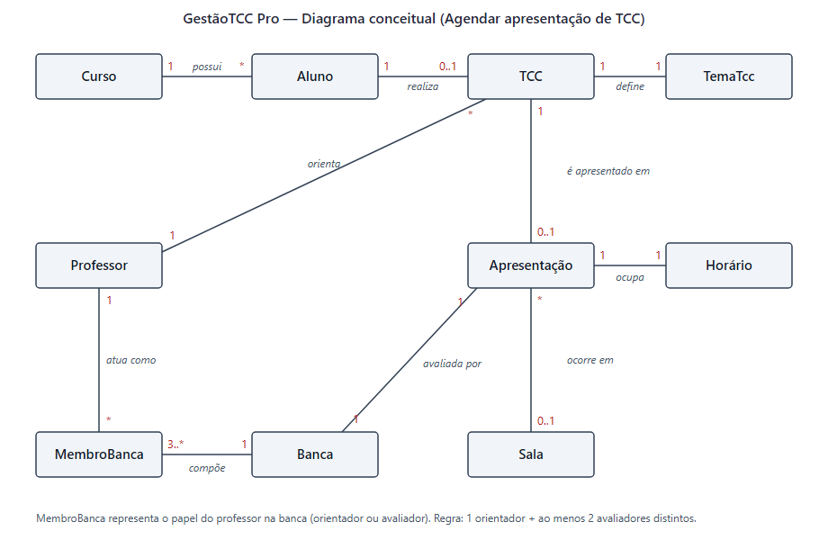

# Agendar apresentação de TCC — Cenários e testes de aceitação

**Projeto:** GestãoTCC Pro — **Grupo 3**

**Integrantes:** Henrique Werner Delazeri · Leonardo Gomes Vechieti · Lucas Bauer de Souza ·
Rodrigo Libraga Fernandes · Vinicius Rubin

## 1. Requisito escolhido

Requisitos do caso **R7 (formar bancas avaliadoras)**, **R8 (verificar conflitos de horário)**
e **R9 (agendar apresentações de TCC)**, que correspondem aos pacotes de trabalho da EAP:

| EAP | Pacote de trabalho | Requisito |
|---|---|---|
| 5.1 | Formação de bancas avaliadoras | R7 |
| 5.3 | Verificação de conflitos de agenda | R8 |
| 5.4 | Agendamento de apresentações | R9 |
| 5.5 | Definição de sala e horário | R8, R9 |

A escolha responde a um risco declarado no Project Model Canvas: *"Conflitos de agenda não
resolvidos → validar professor, aluno, sala e modalidade antes da confirmação"*.

## 2. História de usuário

> **Como** coordenador(a) de TCC,
> **quero** agendar a apresentação de um TCC com a sua banca avaliadora,
> **para** garantir data, horário, sala e avaliadores sem conflitos antes da confirmação.

**Critérios de aceitação (regras):**

- A banca tem exatamente 1 orientador e pelo menos 2 avaliadores, sem professor repetido.
- Apresentação presencial exige sala; apresentação virtual exige link de reunião.
- Não há agendamento em feriado.
- Uma apresentação dura 60 minutos; dois horários conflitam quando os intervalos se
  sobrepõem no mesmo dia.
- No mesmo horário, um professor não participa de duas bancas, uma sala não recebe duas
  apresentações e um aluno não apresenta duas vezes.

## 3. Cenários

**Contexto comum:** banca formada por Ana (orientadora), Bruno e Carla (avaliadores); TCC
`tcc-1` do aluno `aluno-1`; apresentação presencial na sala 204 em 10/11/2026 às 14:00.

### Cenário 1: agendamento válido

- **Dado** uma banca válida, a sala 204 livre e 10/11/2026 um dia útil
- **Quando** a coordenação agenda a apresentação presencial para 10/11/2026 às 14:00
- **Então** a apresentação fica com status `agendada` na sala 204

### Cenário 2: conflito de professor

- **Dado** que o avaliador Bruno já participa de outra banca em 10/11/2026 às 14:00
- **Quando** a coordenação agenda a apresentação para o mesmo horário
- **Então** o agendamento é recusado com `CONFLITO_PROFESSOR`, e a mensagem cita o nome
  "Bruno"

### Cenário 3: conflito de sala

- **Dado** que a sala 204 já está reservada para outra banca em 10/11/2026 às 14:00
- **Quando** a coordenação agenda uma apresentação presencial na sala 204 no mesmo horário
- **Então** o agendamento é recusado com `CONFLITO_SALA`

### Cenário 4: conflito do aluno

- **Dado** que o aluno já tem outra apresentação em 10/11/2026 às 14:00
- **Quando** a coordenação agenda a apresentação dele para o mesmo horário
- **Então** o agendamento é recusado com `CONFLITO_ALUNO`

### Cenário 5: apresentação virtual sem link

- **Dado** uma apresentação na modalidade virtual sem link de reunião
- **Quando** a coordenação agenda
- **Então** o agendamento é recusado com `LINK_OBRIGATORIO`

### Cenário 6: apresentação presencial sem sala

- **Dado** uma apresentação na modalidade presencial sem sala definida
- **Quando** a coordenação agenda
- **Então** o agendamento é recusado com `SALA_OBRIGATORIA`

### Cenário 7: banca sem orientador

- **Dado** uma banca formada apenas pelos avaliadores Bruno e Carla, sem orientador
- **Quando** a coordenação forma a banca
- **Então** a formação é recusada com `BANCA_INVALIDA`

### Cenário 8: banca com apenas 1 avaliador

- **Dado** uma banca com a orientadora Ana e somente o avaliador Bruno
- **Quando** a coordenação forma a banca
- **Então** a formação é recusada com `BANCA_INVALIDA`

### Cenário 9: professor repetido na banca

- **Dado** uma banca em que a orientadora Ana também foi incluída como avaliadora
- **Quando** a coordenação forma a banca
- **Então** a formação é recusada com `BANCA_INVALIDA`

### Cenário 10: feriado

- **Dado** que 02/11/2026 é feriado (Finados)
- **Quando** a coordenação agenda a apresentação para 02/11/2026
- **Então** o agendamento é recusado com `FERIADO`

## 4. Rastreabilidade: cenário → teste unitário

Todos os testes estão em `projeto/tests/unit/apresentacao/`. Cada cenário é um grupo de
teste com o mesmo número e título, e o nome do teste repete o Dado/Quando/Então.

| Cenário | Arquivo | Teste |
|---|---|---|
| 1 | `agendar_apresentacao.spec.ts` | Dado banca válida, sala livre e dia útil… Então fica agendada |
| 2 | `agendar_apresentacao.spec.ts` | Dado avaliador já em outra banca no horário… Então recusa CONFLITO_PROFESSOR |
| 3 | `agendar_apresentacao.spec.ts` | Dado sala já reservada no horário… Então recusa CONFLITO_SALA |
| 4 | `agendar_apresentacao.spec.ts` | Dado aluno já com apresentação no horário… Então recusa CONFLITO_ALUNO |
| 5 | `agendar_apresentacao.spec.ts` | Dado modalidade virtual sem link… Então recusa LINK_OBRIGATORIO |
| 6 | `agendar_apresentacao.spec.ts` | Dado modalidade presencial sem sala… Então recusa SALA_OBRIGATORIA |
| 7 | `banca.spec.ts` | Dado uma banca sem orientador… Então recusa BANCA_INVALIDA |
| 8 | `banca.spec.ts` | Dado apenas 1 avaliador… Então recusa BANCA_INVALIDA |
| 9 | `banca.spec.ts` | Dado o orientador repetido como avaliador… Então recusa BANCA_INVALIDA |
| 10 | `agendar_apresentacao.spec.ts` | Dado que a data é feriado… Então recusa FERIADO |
| apoio | `banca.spec.ts` | Formação de banca válida (pré-condição do cenário 1) |
| apoio | `horario.spec.ts` | 4 testes de sobreposição de horários (base dos cenários 2–4) |

**Resultado:** `Tests 15 passed (15)`.

## 5. Diagrama conceitual

## 6. Como o código foi desenvolvido (TDD, refatoração e SOLID)

- **TDD:** uma lista de 7 tarefas derivada dos cenários foi implementada em 7 ciclos. Em
  cada ciclo, o teste foi escrito primeiro e executado até falhar (vermelho). Depois veio o
  código mais simples para passar (verde) e, quando havia o que melhorar, a refatoração com
  os testes verdes. O diário completo, com a saída dos testes em cada passo, está em
  `evolucao-tdd.md`.
- **Refatorações:**
  - **Ciclo 4 (SRP):** as regras de modalidade saíram do caso de uso e foram para
    `Apresentacao.criar`.
  - **Ciclo 7 (OCP):** o laço com três `if`s virou estratégias `RegraConflito`. A versão
    anterior está em `refatoracao/`.
- **SOLID:**
  - **S:** `Banca`, `Apresentacao` e `Horario` validam as próprias regras.
  - **O:** uma regra de conflito nova é uma classe nova.
  - **L:** dublês e implementações reais das portas são intercambiáveis.
  - **I:** as portas têm um método cada.
  - **D:** o caso de uso depende de interfaces (`portas.ts`), não de banco nem de HTTP.
